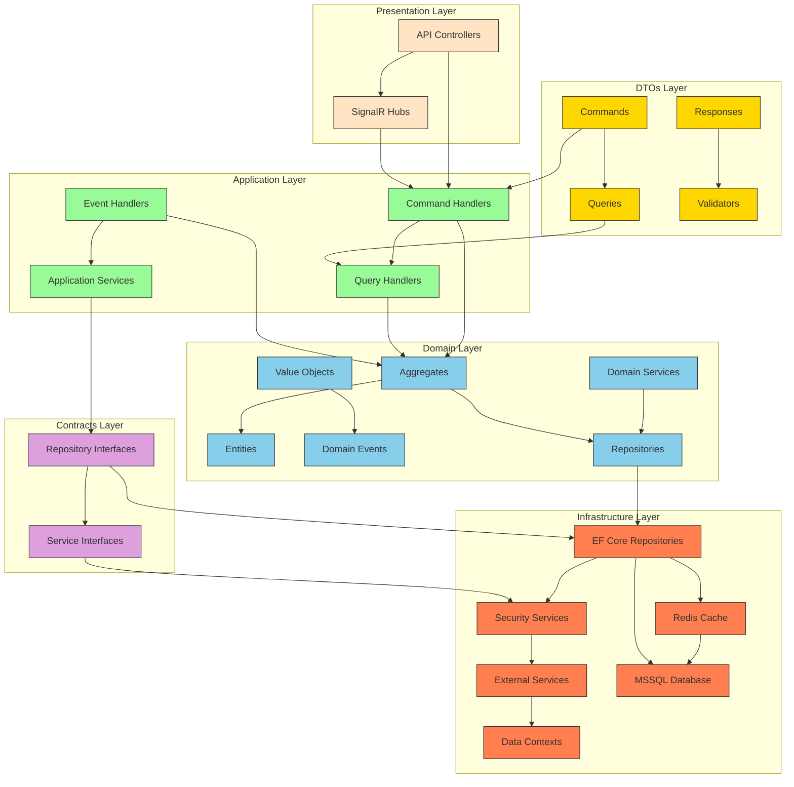
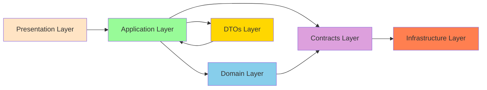
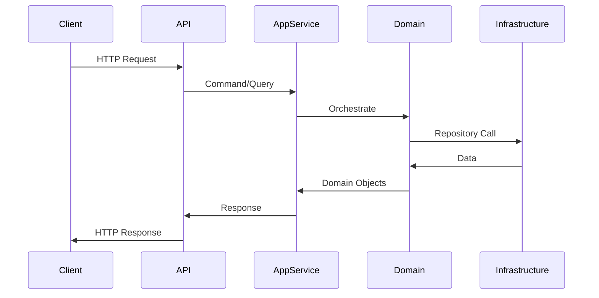
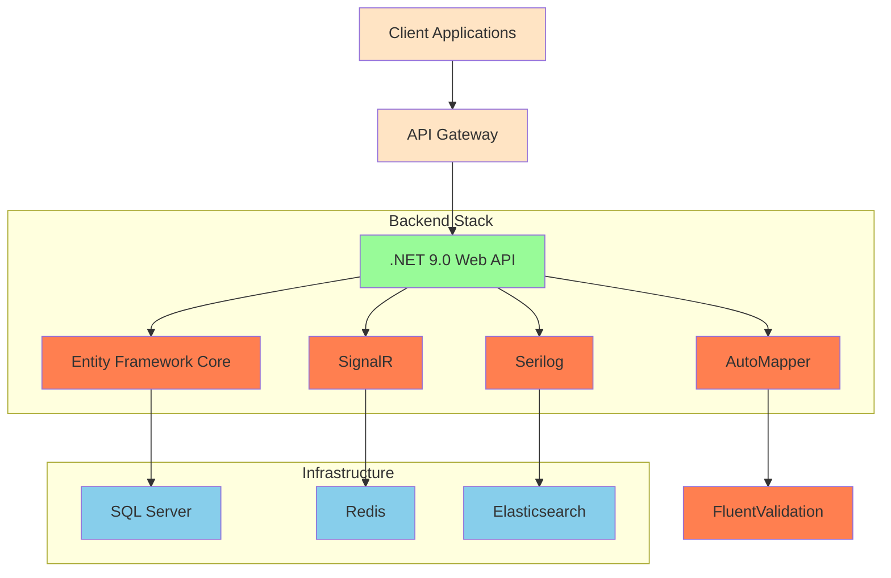

# ArkaSoftware - Architecture Overview

## System Architecture Diagram

```mermaid
graph TB
    subgraph "Presentation Layer"
        A[API Controllers] --> B[SignalR Hubs]
    end

    subgraph "Application Layer"
        C[Command Handlers] --> D[Query Handlers]
        E[Event Handlers] --> F[Application Services]
    end

    subgraph "Domain Layer"
        G[Aggregates] --> H[Entities]
        I[Value Objects] --> J[Domain Events]
        K[Domain Services] --> L[Repositories]
    end

    subgraph "Contracts Layer"
        M[Repository Interfaces] --> N[Service Interfaces]
    end

    subgraph "DTOs Layer"
        O[Commands] --> P[Queries]
        Q[Responses] --> R[Validators]
    end

    subgraph "Infrastructure Layer"
        S[EF Core Repositories] --> T[Security Services]
        U[External Services] --> V[Data Contexts]
        W[Redis Cache] --> X[MSSQL Database]
    end

    A --> C
    B --> C
    C --> G
    D --> G
    E --> G
    F --> M
    G --> L
    L --> S
    M --> S
    N --> T
    O --> C
    P --> D
    S --> X
    S --> W
    T --> U

    style A fill:#ffe4c4,stroke:#333
    style B fill:#ffe4c4,stroke:#333
    style C fill:#98fb98,stroke:#333
    style D fill:#98fb98,stroke:#333
    style E fill:#98fb98,stroke:#333
    style F fill:#98fb98,stroke:#333
    style G fill:#87ceeb,stroke:#333
    style H fill:#87ceeb,stroke:#333
    style I fill:#87ceeb,stroke:#333
    style J fill:#87ceeb,stroke:#333
    style K fill:#87ceeb,stroke:#333
    style L fill:#87ceeb,stroke:#333
    style M fill:#dda0dd,stroke:#333
    style N fill:#dda0dd,stroke:#333
    style O fill:#ffd700,stroke:#333
    style P fill:#ffd700,stroke:#333
    style Q fill:#ffd700,stroke:#333
    style R fill:#ffd700,stroke:#333
    style S fill:#ff7f50,stroke:#333
    style T fill:#ff7f50,stroke:#333
    style U fill:#ff7f50,stroke:#333
    style V fill:#ff7f50,stroke:#333
    style W fill:#ff7f50,stroke:#333
    style X fill:#ff7f50,stroke:#333
```

## Layer Dependencies

```mermaid
graph LR
    A[Presentation Layer] --> B[Application Layer]
    B --> C[Domain Layer]
    B --> D[Contracts Layer]
    B --> E[DTOs Layer]
    C --> D
    D --> F[Infrastructure Layer]
    E --> B

    style A fill:#ffe4c4
    style B fill:#98fb98
    style C fill:#87ceeb
    style D fill:#dda0dd
    style E fill:#ffd700
    style F fill:#ff7f50
```

## Data Flow

```mermaid
sequenceDiagram
    participant Client
    participant API
    participant AppService
    participant Domain
    participant Infrastructure

    Client->>API: HTTP Request
    API->>AppService: Command/Query
    AppService->>Domain: Orchestrate
    Domain->>Infrastructure: Repository Call
    Infrastructure->>Domain: Data
    Domain->>AppService: Domain Objects
    AppService->>API: Response
    API->>Client: HTTP Response
```

## Domain Model Structure

```mermaid
graph TD
    A[UserAggregate] --> B[User]
    A --> C[UserProfile]
    A --> D[UserRole]

    E[StudentAggregate] --> F[Student]
    E --> G[Enrollment]
    E --> H[StudentProfile]

    I[TeacherAggregate] --> J[Teacher]
    I --> K[CourseAssignment]
    I --> L[Qualification]

    M[CourseAggregate] --> N[Course]
    M --> O[CourseContent]
    M --> P[CourseSchedule]

    Q[RoomAggregate] --> R[Room]
    Q --> S[RoomBooking]
    Q --> T[RoomEquipment]

    U[OrderAggregate] --> V[Order]
    U --> W[OrderItem]
    U --> X[Payment]

    Y[BasketAggregate] --> Z[Basket]
    Y --> AA[BasketItem]

    AB[ArticleAggregate] --> AC[Article]
    AB --> AD[ArticleComment]
    AB --> AE[ArticleRating]

    AF[CategoryAggregate] --> AG[Category]
    AF --> AH[CategoryHierarchy]

    AI[TagAggregate] --> AJ[Tag]
    AI --> AK[TagAssignment]

    AL[EducationPlanAggregate] --> AM[EducationPlan]
    AL --> AN[PlanCourse]

    subgraph "Core Aggregates"
        A
        E
        I
        M
        Q
        Y
        AB
        AF
        AI
        AL
    end

    style A fill:#87ceeb
    style E fill:#87ceeb
    style I fill:#87ceeb
    style M fill:#87ceeb
    style Q fill:#87ceeb
    style Y fill:#87ceeb
    style AB fill:#87ceeb
    style AF fill:#87ceeb
    style AI fill:#87ceeb
    style AL fill:#87ceeb
```

## Technology Stack Overview

```mermaid
graph TB
    A[Client Applications] --> B[API Gateway]
    B --> C[.NET 9.0 Web API]
    C --> D[Entity Framework Core]
    C --> E[SignalR]
    C --> F[AutoMapper]
    C --> G[Serilog]
    D --> H[SQL Server]
    E --> I[Redis]
    F --> J[FluentValidation]
    G --> K[Elasticsearch]

    subgraph "Backend Stack"
        C
        D
        E
        F
        G
    end

    subgraph "Infrastructure"
        H
        I
        K
    end

    style A fill:#ffe4c4
    style B fill:#ffe4c4
    style C fill:#98fb98
    style D fill:#ff7f50
    style E fill:#ff7f50
    style F fill:#ff7f50
    style G fill:#ff7f50
    style H fill:#87ceeb
    style I fill:#87ceeb
    style J fill:#ff7f50
    style K fill:#87ceeb
```